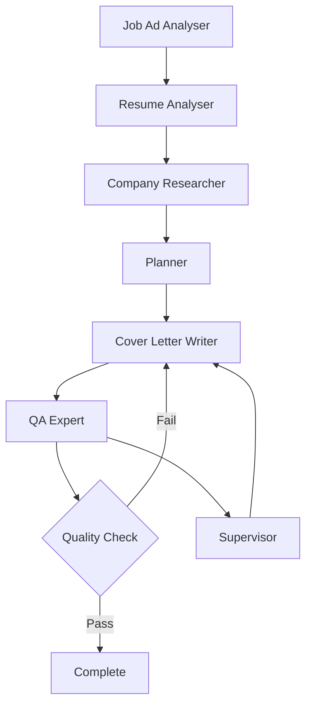

# README.md

## AI Cover Letter Generator

A sophisticated AI-powered cover letter generator using LangGraph multi-agent architecture, Streamlit UI, and MCP (Model Context Protocol) servers.

## Features

🤖 **Multi-Agent Architecture**: Uses LangGraph supervisor pattern with specialised agents:

- **Job Ad Analyser**: Fetches and analyses job advertisements using Fetch MCP server
- **Resume Analyser**: Processes resume content with vector storage using FAISS
- **Company Researcher**: Researches company information using Brave Search MCP server  
- **Planner**: Creates strategic cover letter plans
- **Cover Letter Writer**: Generates tailored cover letters following SEEK.com.au guidelines
- **QA Expert**: Reviews and ensures cover letter quality
- **Supervisor**: Orchestrates the entire workflow

📝 **Smart Content Generation**:

- Matches resume experiences to job requirements
- Incorporates company culture and values
- Follows professional writing standards
- Multiple style options (Professional, Classic, Technical, Modern, etc.)

🔍 **Advanced Analysis**:

- Vector database storage for resume content
- Semantic search for relevant experiences
- Company research integration
- Quality assessment and iterative improvement

## Prerequisites

- Python 3.9+
- uv package manager
- OpenAI API key
- Brave Search API key (optional, for company research)

## Installation

### 1. Clone and Setup Project

```bash
git clone <repository-url>
cd cover-letter-app

# Initialise with uv
uv init
```

### 2. Install Dependencies

```bash
uv add streamlit langgraph langchain langchain-openai langchain-community faiss-cpu python-dotenv requests beautifulsoup4 markdown pydantic aiohttp
```

### 3. Environment Configuration

```bash
cp .env.example .env
```

Edit `.env` file with your API keys:

```env
OPENAI_API_KEY=your_openai_api_key_here
BRAVE_API_KEY=your_brave_search_api_key_here
```

### 4. Create Required Directories

```bash
mkdir -p data src/agents src/graph src/utils src/config
```

### 5. Add SEEK Instructions

Create `data/SEEK_cover_letter_instructions.md` with the provided content.

## Project Structure

```text
cover-letter-app/
├── pyproject.toml
├── README.md
├── .env.example
├── data/
│   └── SEEK_cover_letter_instructions.md
├── src/
│   ├── app.py                    # Streamlit main application
│   ├── agents/                   # Individual agent implementations
│   │   ├── job_ad_analyser.py
│   │   ├── resume_analyser.py
│   │   ├── company_researcher.py
│   │   ├── planner.py
│   │   ├── cover_letter_writer.py
│   │   ├── qa_expert.py
│   │   └── supervisor.py
│   ├── graph/                    # LangGraph workflow
│   │   ├── state.py
│   │   └── workflow.py
│   ├── utils/                    # Utilities
│   │   ├── mcp_clients.py
│   │   └── vector_store.py
│   └── config/
│       └── settings.py
```

## Usage

### 1. Start the Application

```bash
uv run python -m streamlit run src/app.py
```

### 2. Using the Interface

1. **Enter Job URL**: Paste the job advertisement URL from SEEK or other job boards
2. **Upload Resume**: Upload your resume in Markdown format
3. **Select Style**: Choose your preferred cover letter style
4. **Generate**: Click "Generate Cover Letter" to start the AI workflow
5. **Review**: Review the generated cover letter and quality assessment
6. **Download**: Download the final cover letter

### 3. Workflow Process

The application follows this automated workflow:

1. Fetches and analyses the job advertisement
2. Processes your resume content using vector embeddings
3. Researches the company using web search
4. Creates a strategic plan for the cover letter
5. Writes the initial cover letter draft
6. Reviews quality and suggests improvements
7. Iterates until quality threshold is met (max 3 iterations)

## API Requirements

### OpenAI API

- Required for all LLM operations
- Used by all agents for analysis and generation
- Estimated cost: $0.10-0.50 per cover letter generation

### Brave Search API (Optional)

- Used for company research
- Provides enhanced company information
- Free tier available with limitations

## MCP Servers

The application integrates with MCP (Model Context Protocol) servers:

### Fetch MCP Server

- **URL**: <https://smithery.ai/server/fetch-mcp/api>
- **Purpose**: Fetch job advertisement content
- **Format**: Returns content in Markdown format

### Brave Search MCP Server  

- **URL**: <https://smithery.ai/server/@smithery-ai/brave-search/api>
- **Purpose**: Search for company information
- **Authentication**: Requires Brave API key

## Configuration Options

### Cover Letter Styles

- **Professional**: Traditional business format
- **Creative**: More engaging and personalised tone
- **Technical**: Focus on technical skills and achievements
- **Executive**: Senior-level positioning and leadership focus
- **Casual**: Relaxed tone for startup/casual environments

### Quality Thresholds

- Minimum score: 8/10 for auto-approval
- Maximum iterations: 3 attempts
- Assessment criteria: Experience matching, company understanding, writing quality

## Troubleshooting

### Common Issues

**1. API Key Errors**

```bash
# Check your .env file
cat .env
# Ensure API keys are properly set
```

**2. MCP Server Connection Issues**

```bash
# Test MCP servers are accessible
curl -X POST https://smithery.ai/server/fetch-mcp/api \
  -H "Content-Type: application/json" \
  -d '{"method": "fetch", "params": {"url": "https://example.com"}}'
```

**3. Vector Store Issues**

```bash
# Clear FAISS index if corrupted
rm -rf .faiss_index/
```

**4. Streamlit Issues**

```bash
# Clear Streamlit cache
streamlit cache clear
```

### Debug Mode

Enable debug logging by setting environment variable:

```bash
export LANGCHAIN_DEBUG=true
uv run streamlit run src/app.py
```

## Development

### Running Tests

```bash
uv add pytest pytest-asyncio --dev
uv run pytest
```

### Code Formatting

```bash
uv add black flake8 mypy --dev
uv run black src/
uv run flake8 src/
uv run mypy src/
```

### Adding New Agents

1. Create new agent class in `src/agents/`
2. Add agent to workflow in `src/graph/workflow.py`
3. Update state schema in `src/graph/state.py` if needed
4. Add routing logic in supervisor

## Contributing

1. Fork the repository
2. Create a feature branch
3. Make your changes
4. Add tests for new functionality
5. Submit a pull request

## License

MIT License - see LICENSE file for details

## Support

For issues and questions:

1. Check the troubleshooting section
2. Review the GitHub issues
3. Create a new issue with detailed description

---

## Architecture Details

### Multi-Agent Supervisor Pattern

The application implements the LangGraph multi-agent supervisor architecture:



### State Management

The application uses a centralised state graph that flows between agents:

- Job details (requirements, skills, competencies)
- Resume analysis (experiences, achievements, skills)
- Company information (profile, culture, values)
- Cover letter plan and content
- Quality feedback and iteration tracking

### Vector Storage

Resume content is processed using:

- Text chunking with overlap
- OpenAI embeddings
- FAISS vector similarity search
- Semantic matching of experiences to job requirements

This comprehensive setup provides a production-ready AI cover letter generator with sophisticated multi-agent orchestration and professional-quality output.

## Known Issues

MCP Servers integration through [Smithery](https://smithery.ai/) had issues and has been disabled for now. Static content is loaded from data/*.md files instead.
